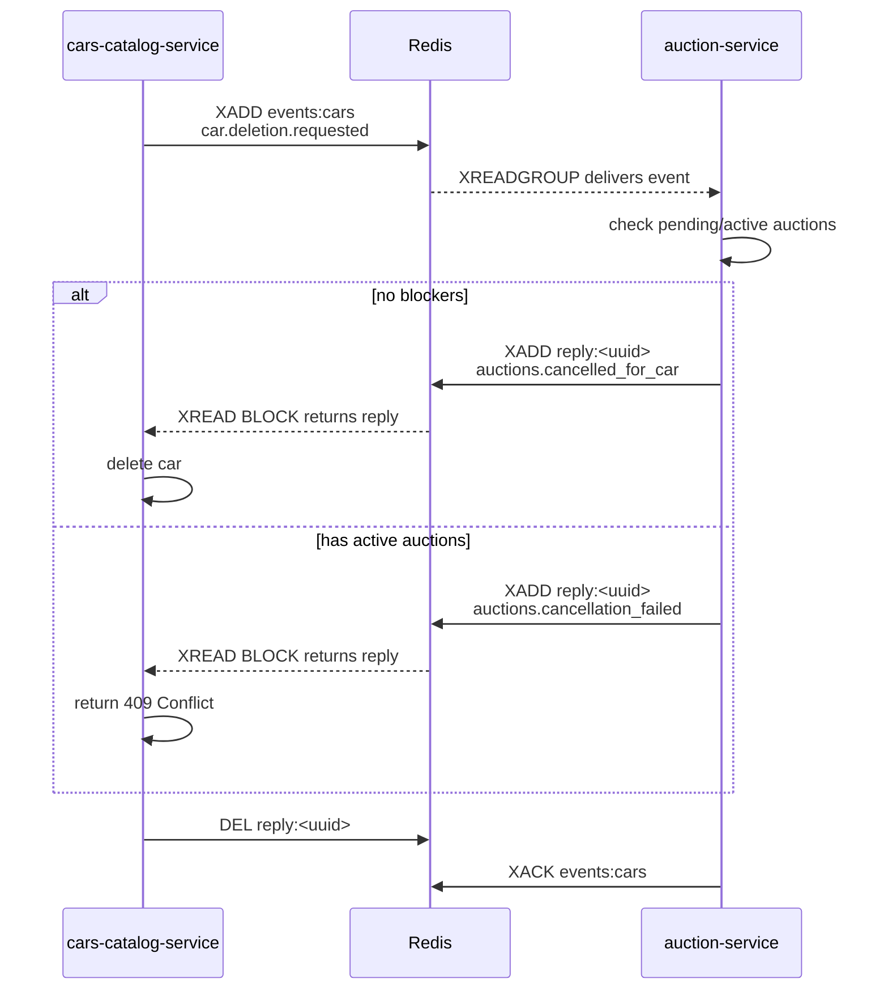

# @cars-auction/events

Shared library of Redis Streams helpers used by every service in the cars-auction system. It exports a Redis client factory, typed event definitions, a publisher, and a consumer-group loop.

## What Redis does in this system

Redis acts as the **message broker** between microservices. Rather than calling each other over HTTP, services write events to named Redis Streams and read from them independently. This decouples services: a producer never waits for a consumer to be ready, and a slow or restarting consumer does not lose messages.

### Why Redis Streams, not pub/sub

Redis's classic `PUBLISH`/`SUBSCRIBE` is fire-and-forget — a subscriber that is down misses messages permanently. Redis Streams are an **append-only log**: every message is persisted with a monotonically increasing ID and can be replayed at any time. Consumer groups add at-least-once delivery semantics, so no message is silently dropped.

### Streams used

| Stream | Producer | Consumer group | Purpose |
|---|---|---|---|
| `events:cars` | cars-catalog-service | `auction-service` | Signals that a car deletion was requested |
| `events:auctions` | auction-service | `cars-catalog-service` | General auction lifecycle events |
| `reply:<correlationId>` | auction-service | — (direct read) | Ephemeral reply for the deletion saga |

### The deletion saga

When a user tries to delete a car, a two-step choreography prevents data corruption:



cars-catalog-service blocks on the ephemeral `reply:<correlationId>` stream for up to 5 seconds. On timeout it fails open and deletes the car with a warning (infrastructure downtime should not permanently block user operations). The reply stream is deleted by the requester after reading; a 30-second TTL on the stream is a safety net if the requester dies first.

### Delivery guarantees

- Messages are acknowledged (`XACK`) **only after** the handler resolves successfully. If the handler throws, the message stays in the Pending-Entry List (PEL) and can be reclaimed later with `XAUTOCLAIM`.
- `MKSTREAM` on group creation means either service can start first — the stream is created automatically.
- Two Redis connections are used per service that does blocking reads: one for regular commands (`XADD`, `XACK`, `DEL`) and one dedicated to `XREADGROUP BLOCK`, because a blocked connection cannot issue any other command.

## Package structure

| File | What it exports |
|---|---|
| [src/client.ts](src/client.ts) | `createRedisClient(options)` — ioredis factory, sets `maxRetriesPerRequest: null` for blocking connections |
| [src/events.ts](src/events.ts) | Stream/group name constants, event interfaces, `parseFields` / `flattenEvent` helpers |
| [src/publisher.ts](src/publisher.ts) | `publish(redis, stream, event)` — thin wrapper around `XADD` |
| [src/consumer.ts](src/consumer.ts) | `ensureConsumerGroup` + `startConsumerLoop` — reusable `XREADGROUP` loop with ack-on-success |

## Inspecting streams at runtime

```bash
# All messages in the cars event stream
docker compose exec redis redis-cli XRANGE events:cars - +

# What auction-service has not yet processed
docker compose exec redis redis-cli XPENDING events:cars auction-service - + 10

# Consumer group metadata
docker compose exec redis redis-cli XINFO GROUPS events:cars

# Check an in-flight reply stream
docker compose exec redis redis-cli XLEN reply:<correlationId>
```

## Resources

- [Introduction](https://dev.to/mehmetakar/redis-streams-a-comprehensive-guide-cal)